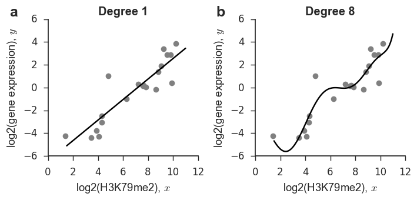
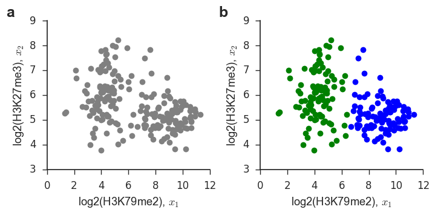

My favorite settings
--------------------

.. code:: python

    import os
    import h5py
    import seaborn
    import matplotlib
    #import pylab as pl
    import numpy as np
    import scipy.stats as st
    from hilearn import id_mapping
    import matplotlib.pyplot as plt
    from hilearn.stats import logistic, logit
    from hilearn.plot import corr_plot, boxgroup, set_colors, favorite_colors, set_style
    from diceseq.utils.misc_utils import loadresult
    %matplotlib inline
    
    set_style()
    
    data_dir = os.path.expanduser("../data/")

.. code:: python

    # regression
    f = h5py.File(data_dir + "regression_data.hdf5", "r")
    X = np.array(f["X"])
    Y = np.array(f["Y"])
    f.close()
    
    # classification
    idx = (Y < -0.5) + (Y > 0.5)
    X1 = X[idx,:]
    Y1 = (Y[idx] > 0.5).astype("int")
    
    marks = ["H2A.Z", "H3K27ac", "H3K27me3", "H3K36me3", "H3K4me1", 
             "H3K4me2", "H3K4me3", "H3K79me2", "H3K9ac", "H3K9me3", "H4K20me1"]

Regression
----------

.. code:: python

    from sklearn.preprocessing import PolynomialFeatures
    from sklearn.linear_model import Ridge
    from sklearn.pipeline import make_pipeline
    #http://scikit-learn.org/stable/auto_examples/linear_model/plot_polynomial_interpolation.html
    
    np.random.seed(0)
    idx = np.random.permutation(1000)[:20]
    x_plot = np.linspace(1.5, 11, 100).reshape(-1,1)
    
    #degree: 1, 8; 5, 18
    fig = plt.figure(figsize=(7.2, 3.5))
    for count, degree in enumerate([1, 8]):
        model = make_pipeline(PolynomialFeatures(degree), Ridge())
        model.fit(X[idx,7:8], Y[idx])
        y_plot = model.predict(x_plot)
        
        ax = plt.subplot(1,2,count+1)
        plt.plot(X[idx,7], Y[idx], "o", color="gray")
        plt.plot(x_plot[:,0], y_plot, color="k")
        plt.xlabel("log2(H3K79me2), $x$")
        plt.ylabel("log2(gene expression), $y$")
        plt.title("Degree %d" % degree)
        plt.legend(loc='best')
        plt.ylim(-6,6)
        ax.text(-0.20, 1.10, ["a","b","c"][count], transform=ax.transAxes,
          fontsize=18, fontweight='bold', va='top', ha='right')
        
    seaborn.despine()
    pl.tight_layout()
    # fig.savefig("../data/overfitting.pdf", dpi=300, bbox_inches='tight')
    # fig.savefig("../data/regression.pdf", dpi=300, bbox_inches='tight')
    plt.show()

Clustering
----------

.. code:: python

    from sklearn.cluster import KMeans
    
    np.random.seed(0)
    idx = np.random.permutation(1000)[:200]
    
    fig = plt.figure(figsize=(7.2, 3.5))
    ax = plt.subplot(1,2,1)
    plt.plot(X[idx,7], X[idx,2], "o", color="gray")
    plt.xlabel("log2(H3K79me2), $x_1$")
    plt.ylabel("log2(H3K27me3), $x_2$")
    ax.text(-0.20, 1.10, "a", transform=ax.transAxes,
      fontsize=18, fontweight='bold', va='top', ha='right')
        
    kmeans = KMeans(n_clusters=2, random_state=0).fit(X[idx,:][:,[7,2]])
    labels = kmeans.labels_
    ax = plt.subplot(1,2,2)
    plt.plot(X[idx,7][labels==0], X[idx,2][labels==0], "o", color="green")
    plt.plot(X[idx,7][labels==1], X[idx,2][labels==1], "o", color="blue")
    plt.xlabel("log2(H3K79me2), $x_1$")
    plt.ylabel("log2(H3K27me3), $x_2$")
    ax.text(-0.20, 1.10, "b", transform=ax.transAxes,
      fontsize=18, fontweight='bold', va='top', ha='right')
        
    seaborn.despine()
    pl.tight_layout()
    fig.savefig("../data/clustering.pdf", dpi=300, bbox_inches='tight')
    plt.show()

