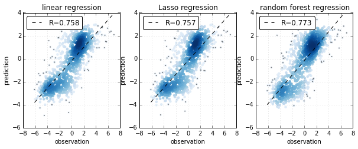
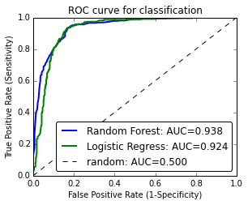

Tutorial for cross-validation wrap
==================================

Load data
~~~~~~~~~

.. code:: python

    import h5py
    import numpy as np
    import scipy.stats as st
    
    # regression
    f = h5py.File("../data/regression_data.hdf5", "r")
    X = np.array(f["X"])
    Y = np.array(f["Y"])
    f.close()
    
    # classification
    idx = (Y < -0.5) + (Y > 0.5)
    X1 = X[idx,:]
    Y1 = (Y[idx] > 0.5).astype("int")

Regression
~~~~~~~~~~

.. code:: python

    # import os
    # os.chdir("../")
    
    import pylab as pl
    import matplotlib
    from sklearn import linear_model
    from sklearn.ensemble import RandomForestRegressor
    from hilearn import CrossValidation, corr_plot
    %matplotlib inline
    
    # define the model objects
    linreg = linear_model.LinearRegression()
    lassoreg = linear_model.LassoCV(cv=3)
    randforest = RandomForestRegressor(n_estimators=100, n_jobs=-1)
    
    fig = pl.figure()
    pl.subplot(1,3,1)
    # Cross-Validation wrap & corr_plot
    CV = CrossValidation(X,Y)
    Y_pre = CV.cv_regression(linreg)
    corr_plot(Y, Y_pre, size=20)
    
    pl.xlabel("observation")
    pl.ylabel("prediction")
    pl.title("linear regression")
    pl.ylim(-6,4)
    
    pl.subplot(1,3,2)
    CV = CrossValidation(X,Y)
    Y_pre = CV.cv_regression(lassoreg)
    corr_plot(Y, Y_pre, size=20)
    pl.xlabel("observation")
    pl.ylabel("prediction")
    pl.title("Lasso regression")
    pl.ylim(-6,4)
    
    pl.subplot(1,3,3)
    CV = CrossValidation(X,Y)
    Y_pre = CV.cv_regression(randforest)
    corr_plot(Y, Y_pre, size=20)
    pl.xlabel("observation")
    pl.ylabel("prediction")
    pl.title("random forest regression")
    pl.ylim(-6,4)
    
    fig.set_size_inches(10,3.5)
    # fig.savefig("cv_regression.pdf", dpi=300, bbox_inches='tight')
    pl.show()

Classification
~~~~~~~~~~~~~~

.. code:: python

    import scipy.stats as st
    from sklearn import linear_model
    from sklearn.ensemble import RandomForestClassifier
    from hilearn import ROC_plot, CrossValidation
    
    LogisticRegression = linear_model.LogisticRegression()
    RF_class = RandomForestClassifier(n_estimators=100, n_jobs=-1)
    
    CV = CrossValidation(X1, Y1)
    Y1_pre, Y1_score = CV.cv_classification(model=RF_class, folds=10)
    Y2_pre, Y2_score = CV.cv_classification(model=LogisticRegression, folds=10)
    
    fig = pl.figure()
    ROC_plot(Y1, Y1_score[:,1], label="Random Forest", base_line=False)
    ROC_plot(Y1, Y2_score[:,1], label="Logistic Regress")
    pl.title("ROC curve for classification")
    
    fig.set_size_inches(4.5,3.5)
    # fig.savefig("cv_classification.pdf", dpi=300, bbox_inches='tight')
    pl.show()

Test on Mixture of linear regression
~~~~~~~~~~~~~~~~~~~~~~~~~~~~~~~~~~~~

.. code:: python

    from hilearn import MixLinearRegression
    
    mixlinreg = MixLinearRegression()
    mixlinreg.fit(X,Y,K=3,run_min=100, gap_ratio=0.0001)
    print mixlinreg.bic, mixlinreg.loglik
    # flexmix: 3894.991, -1805.886
    
    mixlinreg = MixLinearRegression()
    mixlinreg.fit(X,Y,K=4,run_min=100, gap_ratio=0.0001)
    print mixlinreg.bic, mixlinreg.loglik
    # flexmix: 3925.898, -1772.986

.. parsed-literal::

    3900.86507656 -1808.82355506
    3908.89353456 -1764.48349711

