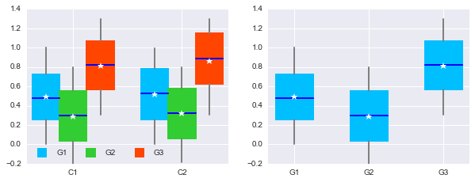
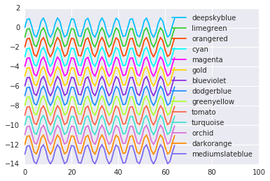
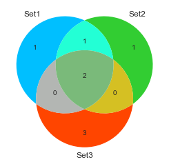

Tutorials for hilearn plots
===========================

boxgroup
~~~~~~~~

.. code:: python

    import seaborn
    import pylab as pl
    import numpy as np
    from hilearn.plot import boxgroup
    %matplotlib inline
    
    data1 = [np.random.rand(500), np.random.rand(300)-0.2,  np.random.rand(100)+0.3]
    data2 = [np.random.rand(400), np.random.rand(100)-0.2,  np.random.rand(150)+0.3]
    
    fig = pl.figure(figsize=(10,3.5))
    pl.subplot(1,2,1)
    bp = boxgroup([data1, data2], labels=("G1","G2","G3"), conditions=["C1", "C2"])
    pl.subplot(1,2,2)
    bp = boxgroup(data1, conditions=("G1","G2","G3"))
    pl.show()

favorite color for use
~~~~~~~~~~~~~~~~~~~~~~

.. code:: python

    import seaborn
    import numpy as np
    import pylab as pl
    import matplotlib
    from hilearn.plot import set_colors
    %matplotlib inline
        
    favorite_colors = set_colors()
    
    fig = pl.figure()
    xx = np.arange(65)
    for i in range(14):
        pl.plot(xx, np.sin(xx)-i, label="%s" %favorite_colors[i])
    pl.legend()
    pl.xlim(0,100)
    pl.show()

venn3\_plot
~~~~~~~~~~~

.. code:: python

    import seaborn
    import numpy as np
    import pylab as pl
    import matplotlib
    from hilearn.plot import venn3_plot
    %matplotlib inline
    
    fig = pl.figure()
    set1 = set(['A', 'B', 'C', 'D'])
    set2 = set(['B', 'C', 'D', 'E'])
    set3 = set(['C', 'D',' E', 'F', 'G'])
    v = venn3_plot([set1, set2, set3], ('Set1', 'Set2', 'Set3'))
    pl.show()

